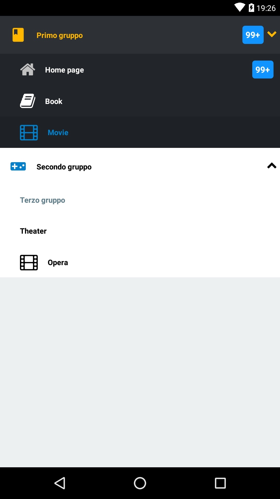

# React Native: react-native-collapsing

[](https://github.com/gaetanozappi/react-native-collapsing)
[](https://www.npmjs.com/package/react-native-collapsing)

[](https://github.com/gaetanozappi/react-native-collapsing)
[](https://www.npmjs.com/package/react-native-collapsing)

[](https://github.com/gaetanozappi/react-native-collapsing/issues)
[](https://github.com/gaetanozappi/react-native-collapsing/issues?q=is%3Aissue+is%3Aclosed)
[](http://github.com/gaetanozappi/react-native-collapsing/issues)
[]()



-   [Usage](#-usage)
-   [License](#-license)

## 📖 Getting started

`$ npm install react-native-collapsing --save`

`$ react-native link react-native-vector-icons`

## 💻 Usage

```javascript
import * as React from 'react';
import { StyleSheet, View } from 'react-native';

import Collapsing from 'react-native-collapsing';

export default class App extends React.Component {
  constructor(props) {
    super(props);
    this.state = {
      selected: '',
    };
  }

  render() {
    return (
      <View style={styles.container}>
        <Collapsing
          selected={this.state.selected}
          title="Primo gruppo"
          background="#22252A"
          backgroundBarNormal="#2D3035"
          backgroundBarFocus="#2D3035"
          iconBarNameNormal="videogame-asset"
          iconBarNameFocus="book"
          iconBarColorNormal="#1194ff"
          iconBarColorFocus="#ffb600"
          textBarColorNormal="#1194ff"
          textBarColorFocus="#ffb600"
          iconBarSize={25}
          showOnStart={true}
          animateIconNameNormal="chevron-down"
          animateIconNameFocus="chevron-up"
          animateIconColorNormal="#1194ff"
          animateIconColorFocus="#ffb600"
          badgeText="100"
          badgeColor="#fff"
          badgeBackground="#1194ff"
          badgeRadius={4}
          badgeFunction={e => {
            return e > 99 ? '99+' : e;
          }}
          onPress={e => {
            this.setState({ selected: e.name });
            console.log('1)' + this.state.selected);
          }}
          menu={[
            {
              name: 'sub0',
              title: 'Home page',
              icon: 'home',
              colorText: '#fff',
              colorTextFocus: '#f2a307',
              colorIcon: '#c1c1c1',
              colorIconFocus: '#0480CB',
              background: 'transparent',
              backgroundFocus: '#1E2125',
              badgeText: '1000',
              badgeColor: '#fff',
              badgeBackground: '#1194ff',
              badgeRadius: 4,
            },
            {
              name: 'sub1',
              title: 'Book',
              icon: 'book',
              colorText: '#fff',
              colorTextFocus: '#f9041d',
              colorIcon: '#fff',
              colorIconFocus: '#f9041d',
              //background: '#1194ff',
              backgroundFocus: '#1E2125',
            },
            {
              type: 'menu',
              name: 'sub11',
              title: 'Movie',
              icon: 'film',
              colorText: '#fff',
              colorTextFocus: '#0480CB',
              colorIcon: '#fff',
              colorIconFocus: '#0480CB',
              //background: '#1194ff',
              backgroundFocus: '#1E2125',
            },
          ]}
        />
        <Collapsing
          selected={this.state.selected}
          iconBarNameNormal="videogame-asset"
          iconBarNameFocus="videogame-asset"
          iconBarColorNormal="#0480CB"
          title="Secondo gruppo"
          color="#4CAF50"
          showOnStart={false}
          animateIconNameNormal="chevron-down"
          animateIconNameFocus="chevron-up"
          onPress={e => {
            this.setState({ selected: e.name });
            console.log('2)' + this.state.selected);
          }}
          menu={[
            {
              name: 'sub2',
              title: 'Movie',
              icon: 'home',
            },
            {
              name: 'sub3',
              title: 'Tv',
              icon: 'film',
            },
          ]}
        />
        <Collapsing
          selected={this.state.selected}
          title="Terzo gruppo"
          showOnStart={true}
          onPress={e => {
            this.setState({ selected: e.name });
            console.log('2)' + this.state.selected);
          }}
          menu={[
            {
              name: 'sub4',
              title: 'Theater',
            },
            {
              name: 'sub5',
              title: 'Opera',
              icon: 'film',
            },
          ]}
        />
      </View>
    );
  }
}

const styles = StyleSheet.create({
  container: {
    flex: 1,
    backgroundColor: '#ecf0f1',
    marginTop: 24,
  },
});
```

## 💡 Props

| Prop              | Type       | Default | Note                                                                                                       |
| ----------------- | ---------- | ------- | ---------------------------------------------------------------------------------------------------------- |
| `selected`       | `string`   |    | Indicates the selected item.
| `title`       | `string`   |    | Menu title.
| `background`       | `string`   |    | Menu background color.
| `backgroundBarNormal`       | `string`   |    | Background color of the menu title, when the menu is in normal state.
| `backgroundBarFocus`       | `string`   |    | Background color of the menu title, when the menu is in focus state.
| `iconBarNameNormal`       | `MaterialIcons`   |    | Menu name icon, when the menu is in normal state.
| `iconBarNameFocus`       | `MaterialIcons`   |    | Menu name icon, when the menu is in focus state.
| `iconBarColorNormal`       | `string`   |    |  Menu color icon, when the menu is in normal state.
| `iconBarColorFocus`       | `string`   |    |  Menu color icon, when the menu is in focus state.
| `iconBarSize`       | `number`   |    | Icon size.
| `textBarColorNormal`       | `string`   |    |  Menu color text, when the menu is in normal state.
| `textBarColorFocus`       | `string`   |    |  Menu color text, when the menu is in focus state.
| `showOnStart`       | `bool`   |  `false`  | Indicates whether the menu is normal or focus.
| `animateIconNameNormal`       | `FontAwesome`   |    | Menu name animate icon, when the menu is in normal state.
| `animateIconNameFocus`       | `FontAwesome`   |    | Menu name animate icon, when the menu is in focus state.
| `animateIconColorNormal`       | `string`   |    | Menu color animate icon, when the menu is in normal state.
| `animateIconSize`       | `number`   |    | Animated icon size.
| `iconBarSize`       | `number`   |    | Menu title icon, when the menu is in normal state.
| `badgeText`       | `string`   |    | Badge text.
| `badgeColor`       | `string`   |    | Color of the badge text.
| `badgeBackground`       | `string`   |    | Background color of the badge.
| `badgeRadius`       | `number`   |    | Badge radius.
| `badgeFunction`       | `function`   |    | Use in case you want to define a function, for the badgeText attribute.
| `onPress`       | `function`   |    | It is used to recover the pressure event.
| `rippleColor`       | `string`   |    | Ripple color.
| `menu`       | `array`   |    | It is used to define the menu.

#### Menu

| Prop              | Type       | Default | Note                                                                                                       |
| ----------------- | ---------- | ------- | ---------------------------------------------------------------------------------------------------------- |
| `name`       | `string`   |    | Unique name to assign to the item.
| `title`       | `string`   |    | Title of the element.
| `icon`       | `string`   |  `FontAwesome`  | Icon name.
| `colorText`       | `string`   |   `#000000` | Text color.
| `colorTextFocus`       | `string`   | `#607D8B`   | Text color status focus.
| `colorIcon`       | `string`   |  `#000000`  | Icon color.
| `colorIconFocus`       | `string`   |  `#607D8B`   | Icon color status focus.
| `background`       | `string`   |  `transparent`   | Background element.
| `backgroundFocus`       | `string`   |  `#e8e8e8`   | Background element status focus.
| `badgeText`       | `string`   |    | Text badge.
| `badgeColor`       | `string`   |    | Text color badge.
| `badgeBackground`       | `string`   |    | Background badge.
| `badgeRadius`       | `number`   |    | Badge radius.

## 📜 License
This library is provided under the Apache License.
